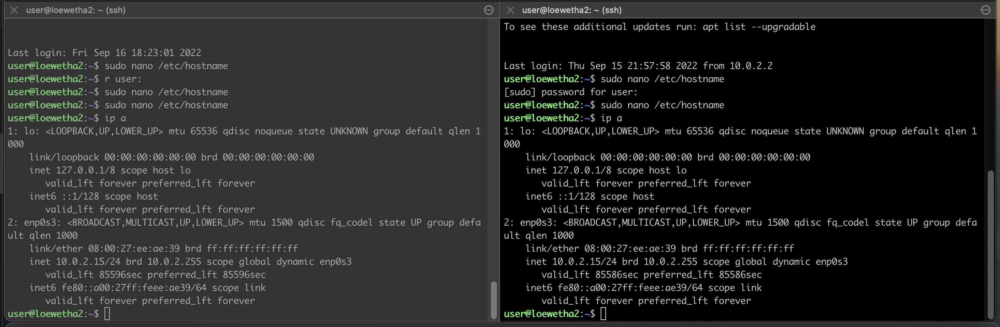
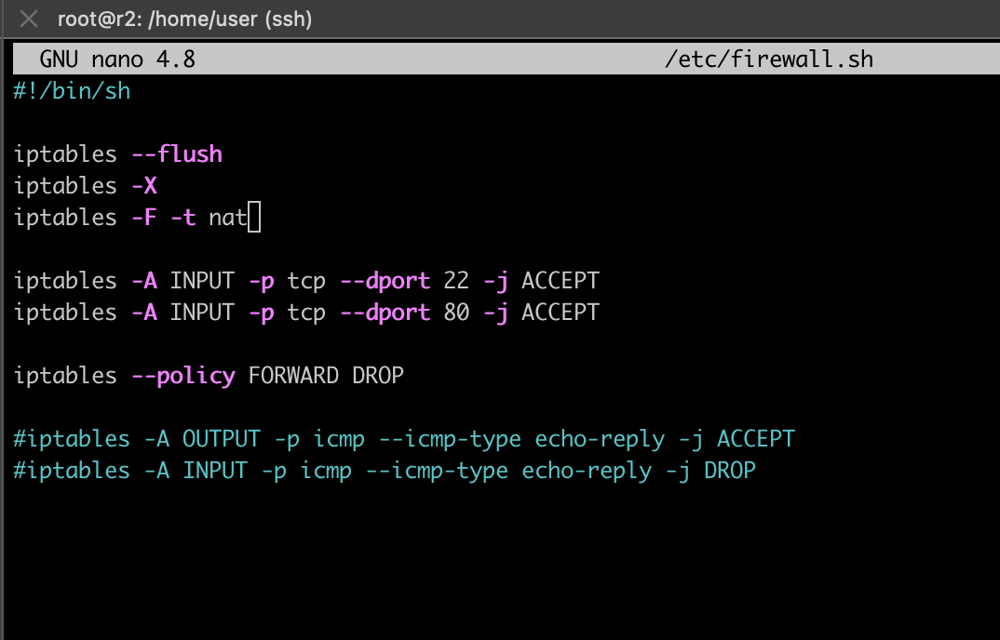

# `Сети в Linux`

Настройка сетей в Linux на виртуальных машинах.

## `Оглавление`

   1. [Инструмент ipcalc](#part-1-инструмент-ipcalc)
   2. [Статическая маршрутизация между двумя машинами](#part-2-статическая-маршрутизация-между-двумя-машинами)
   3. [Утилита iperf3](#part-3-утилита-iperf3)
   4. [Сетевой экран](#part-4-сетевой-экран)
   5. [Статическая маршрутизация сети](#part-5-статическая-маршрутизация-сети)
   6. [Динамическая настройка IP с помощью DHCP](#part-6-динамическая-настройка-ip-с-помощью-dhcp)
   7. [NAT](#part-7-nat)
   8. [Допополнительно. Знакомство с SSH Tunnels](#part-8-дополнительно-знакомство-с-ssh-tunnels)

## `Отчет`

## `Part 1.` Инструмент ipcalc
- устанавливаем инструмент ipcalc с помощью команды `sudo install ipcalc`
### `1.1.` Сети и маски

##### `1)`  Адрес сети 192.167.38.54/13
##### 
##### `2)` Перевод маски 255.255.255.0 в префиксную и двоичную запись
##### 
##### /15 в обычную и двоичную
##### 
##### 11111111.11111111.11111111.11110000 в обычную и префиксную
##### 
#####  `3)` Минимальный и максимальный хост в сети 12.167.38.4 при масках:
##### /8
##### 
##### 11111111.11111111.00000000.00000000
##### 
##### 255.255.254.0
##### 
##### /4
##### 

### `1.2.` localhost
##### Определить и записать в отчёт, можно ли обратиться к приложению, работающему на localhost, со следующими IP: *194.34.23.100*, *127.0.0.2*, *127.1.0.1*, *128.0.0.1*
#### *194.34.23.100* - нет
#### *127.0.0.2* - да
#### *127.1.0.1* - да
#### *128.0.0.1* - нет
localhost (так называемый, «местный» от англ. local, или «локальный хост», по смыслу — этот компьютер) — в компьютерных сетях, стандартное, официально зарезервированное доменное имя для частных IP-адресов (в диапазоне 127.0.0.1 — 127.255.255.254 , RFC 2606).

### `1.3.` Диапазоны и сегменты сетей
##### Определить и записать в отчёт:
##### `1)` какие из перечисленных IP можно использовать в качестве публичного, а какие только в качестве частных: 10.0.0.45, 134.43.0.2, 192.168.4.2, 172.20.250.4, 172.0.2.1, 192.172.0.1, 172.68.0.2, 172.16.255.255, 10.10.10.10, 192.169.168.1
      Частные:
      10.0.0.45
      192.168.4.2
      172.20.250.4
      172.16.255.255
      10.10.10.10

      Публичные:
      134.43.0.2
      172.0.2.1
      172.68.0.2
      192.169.168.1
      192.172.0.1 

      

##### 

##### `2)` какие из перечисленных IP адресов шлюза возможны у сети 10.10.0.0/18: 10.0.0.1, 10.10.0.2, 10.10.10.10, 10.10.100.1, 10.10.1.255

      HostMin:    10.10.0.1
      HostMax:    10.10.63.254 
      
      Возможны    10.10.0.2
                  10.10.10.10
                  10.10.1.255

## `Part 2.` Статическая маршрутизация между двумя машинами
##### Смотрим существующие сетевые интерфейсы с помощью команды `ip a`:

##### 

##### Вывод содержания измененного файла `/etc/netplan/00-installer-config.yaml` для каждой машины и вызов команды `netplan apply` для перезапуска сервиса сети:

##### 
##### 
## `2.1.` Добавление статического маршрута вручную

##### Добавим статистический маршрут при помощи команды `ip r add` и пропингуем соединение между машинами:

##### 

## `2.2.` Добавление статического маршрута с сохранением

##### Добавим статический маршрут от одной машины до другой с помощью файла `etc/netplan/00-installer-config.yaml`, перезапустим сервер сети и пропингуем соединение между машинами:
- редактируем 
#### 
- reboot & ping
#### 

## `Part 3.` Утилита iperf3

## `3.1.` Скорость соединения
### Перевести и записать в отчёт: 8 Mbps в MB/s, 100 MB/s в Kbps, 1 Gbps в Mbps
- apt install iperf3
- 8 Mbps = 1 MB/s
- 100 MB/s = 819200 Kbps
- 1 Gbps = 1024 Mbps

## `3.2.` Утилита iperf3
### Измерить скорость соединения между ws1 и ws2
#### 

## `Part 4.` Сетевой экран

## `4.1.` Утилита iptables

### Стратегия для ws1:

- на ws1 применить стратегию когда в начале пишется запрещающее правило, а в конце пишется разрешающее правило (это касается пунктов 3 и 4)
- открыть на машинах доступ для порта 22 (ssh) и порта 80 (http)
- запретить echo reply (машина не должна "пинговаться”, т.е. должна быть блокировка на OUTPUT)
- разрешить echo reply (машина должна "пинговаться")

### Стратегия для ws2:

- на ws2 применить стратегию когда в начале пишется разрешающее правило, а в конце пишется запрещающее правило (это касается пунктов 3 и 4)
- открыть на машинах доступ для порта 22 (ssh) и порта 80 (http)
- запретить echo reply (машина не должна "пинговаться”, т.е. должна быть блокировка на OUTPUT)
- разрешить echo reply (машина должна "пинговаться")

#### 
- присвоили права и запустили  

#### 

#### Правила выполняться сверху-вниз, следовательно, если правило запрета находиться выше оно срабатывает, а правило разрешения находящиеся ниже нет.

## `4.2.` Утилита nmap

#### Командой ping найти машину, которая не "пингуется", после чего утилитой nmap показать, что хост машины запущен
#### Проверка: в выводе nmap должно быть сказано: Host is up

#### В отчёт поместить скрины с вызовом и выводом использованных команд ping и nmap.
#### 
#### 

- снимки
#### 

## `Part 5.` Статическая маршрутизация сети

#### Сеть:
#### 

## `5.1.` Настройка адресов машин

Содержание файла `etc/netplan/00-installer-config.yaml` для каждой машины:

#### 

Перезапуск сервиса сети и проверка адреса машин (`ip -4 a`):

#### 

Пропинговать ws22 с ws21 и r1 с ws11.

#### 

## `5.2.` Включение переадресации IP-адресов

##### Включение переадресации IP на роутерах с помощью команды `sysctl -w net.ipv4.ip_forward=1`:

#### 

##### Файл */etc/sysctl.conf* с добавленной строкой `net.ipv4.ip_forward = 1`:

#### 

## `5.3.` Установка маршрута по умолчанию

##### Добавим gateway4 [ip адрес] в файлы конфигураций рабочих станций, перезапустим сервис сети и вызовем команду `ip r`:

#### 

##### вызов команды `ip r`:

#### 

- на машине r2 запускаем `tcpdump -tn -i enp0s8` для анализа и перехвата сетевого трафика
- на машине w11 пускаем пинг командой `ping -c 5 10.100.0.12`

#### 

## `5.4.` Добавление статических маршрутов

#### Добавим в роутеры r1 и r2 статические маршруты в файле конфигураций, перезапустим сервис сети и вызовем команду `ip r`:
#### cкрины с содержанием изменённого файла etc/netplan/00-installer-config.yaml для каждого роутера.
#### 
####  и вызовем команду `ip r`
#### 

#### Запустить команды на ws11: `ip r list 10.10.0.0/[маска сети]` и `ip r list 0.0.0.0/0` на ws11:

#### 

#### Для адреса 10.10.0.0/18 был выбран маршрут, отличный от 0.0.0.0/0, поскольку он является адресом сети и доступен без шлюза.

## `5.5.` Построение списка маршрутизаторов

##### Запуск на r1 команды дампа `tcpdump -tnv -i ent0` ,а на ws11 `traceroute 10.20.0.10` - происходит  построение списка маршрутизаторов на пути от ws11 до ws21 при помощи утилиты traceroute:

#### 

Путь строиться от узла к узлу до того момента, покаа не будет достигнута конечная точка. Каждый пакет проходит на своем пути определенное количество узлов, пока достигнет своей цели. На каждом узле добавляется счетчик, который отслеживает количество пройденых узлов.

## `5.6.` Использование протокола ICMP при маршрутизации

Запуск на r1 перехвата сетевого трафика, проходящего через eth0 с помощью команды `tcpdump -n -i enp0s8 icmp` и пинг с ws11 несуществующего IP `ping -c 1 10.30.0.111`:

#### 

## `Part 6.` Динамическая настройка IP с помощью DHCP

`1.` Содержание файла */etc/dhcp/dhcpd.conf* для r2 с конфигурацией службы DHCP:

#### 

Содержание файла *resolv.conf* с `nameserver 8.8.8.8.`:

#### 

`2.` Перезагрузка службы DHCP командой `systemctl restart isc-dhcp-server`:

#### 

Перезагружаем машину ws21 при помощи `reboot` и через `ip a` покажем, что она получила адрес:

#### 

Пинг ws22 с ws21:

#### 

`3.` Меняем MAC адрес у ws11, в `etc/netplan/00-installer-config.yaml` надо добавить строки: `macaddress: 10:10:10:10:10:BA, dhcp4: true`

#### 

`4.` Аналогичная настройка r1 (с жесткой привязкой к MAC адресу)

Конфигурация DHCP:

#### 

DNS:

#### 

Перезагрузка службы DHCP:

#### 

`5.` Запрос обновления ip адреса с ws21

ip до обновления:

#### 

ip после обновления:

#### 

Команда `sudo dhclient -r enp0s3` освобождает текущий адрес интерфейса enp0s3.
Команда `sudo dhclient enp0s3` задает новый адрес указанному интерфейсу.

## `Part 7.` NAT
`1.` Содержание файла */etc/apache2/ports.conf* на ws22 и r2 (строка `Listen 80` изменена на `Listen 0.0.0.0:80`):

#### 
#### 

`2.` Запуск веб-сервера Apache командой `service apache2 start` на ws22 и r1:

#### 
#### 

`3.` Добавление в фаервол на r2 следующих правил:
1) Удаление правил в таблице filter - `iptables -F`
2) Удаление правил в таблице "NAT" - `iptables -F -t nat`
3) Отбрасывать все маршрутизируемые пакеты - `iptables --policy FORWARD DROP`

Добавление правил и запуск фаервола:

#### 
#### запуск 
#### 

Проверка соединения между ws22 и r1 командой ping: не пингуется 

#### 

`4.` Разрешим маршрутизацию всех пакетов протокола ICMP:

#### 

Проверка соединения между ws22 и r1 командой ping:

#### 

`5.` Включить SNAT, а именно маскирование всех локальных ip из локальной сети, находящейся за r2 (сеть 10.20.0.0)

`6.` Включить DNAT на 8080 порт машины r2 и добавить к веб-серверу Apache, запущенному на ws22, доступ извне сети

#### 

Проверка соединения по TCP для SNAT, для этого с ws22 подключиться к серверу Apache на r1 командой `telnet [адрес] [порт]`:

#### 

Проверка соединения по TCP для DNAT, для этого с r1 подключиться к серверу Apache на ws22 командой `telnet` (обращаться по адресу r2 и порту 8080):

#### 

## `Part 8.` Дополнительно. Знакомство с SSH Tunnels

`1.` Запуск веб-сервера Apache на ws22 только на localhost:

#### 

`2.` Воспользоваться *Local TCP forwarding* с ws21 до ws22, чтобы получить доступ к веб-серверу на ws22 с ws21:

#### 

Проверка подключения:

#### 

`3.` Воспользоваться *Remote TCP forwarding* c ws11 до ws22, чтобы получить доступ к веб-серверу на ws22 с ws11 + `4.` проверка подключения:

#### 
